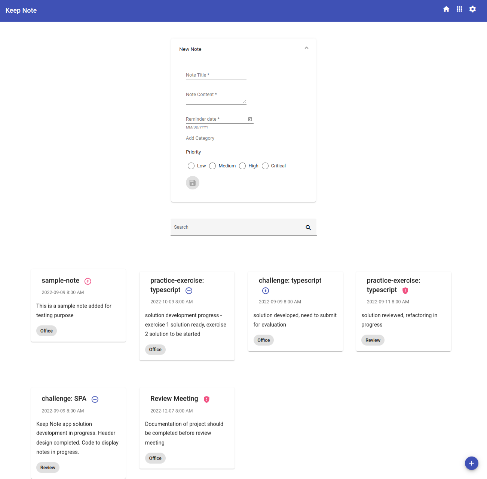
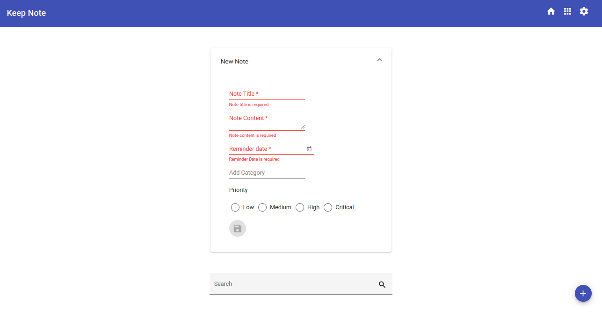
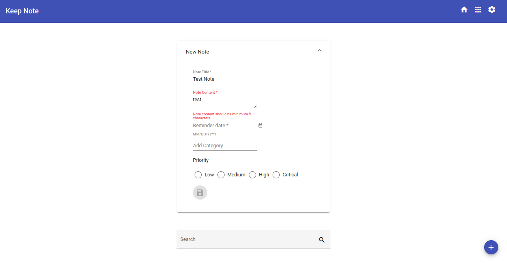
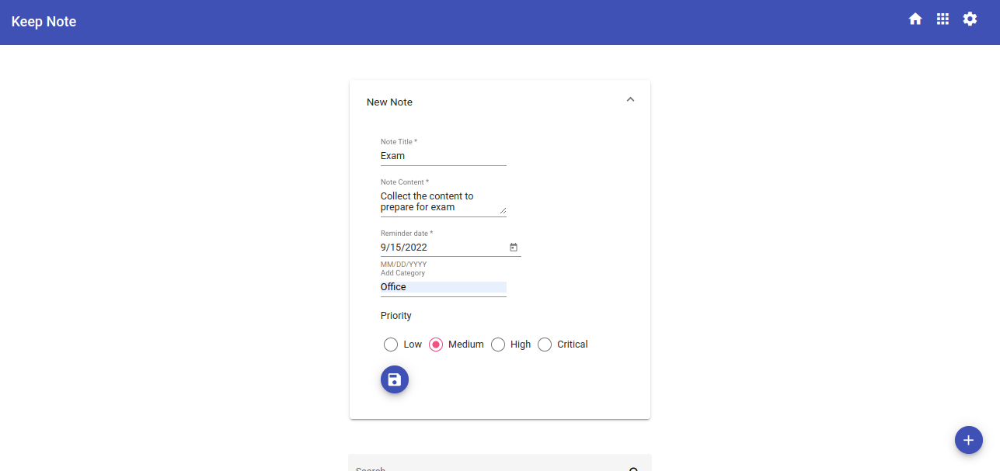
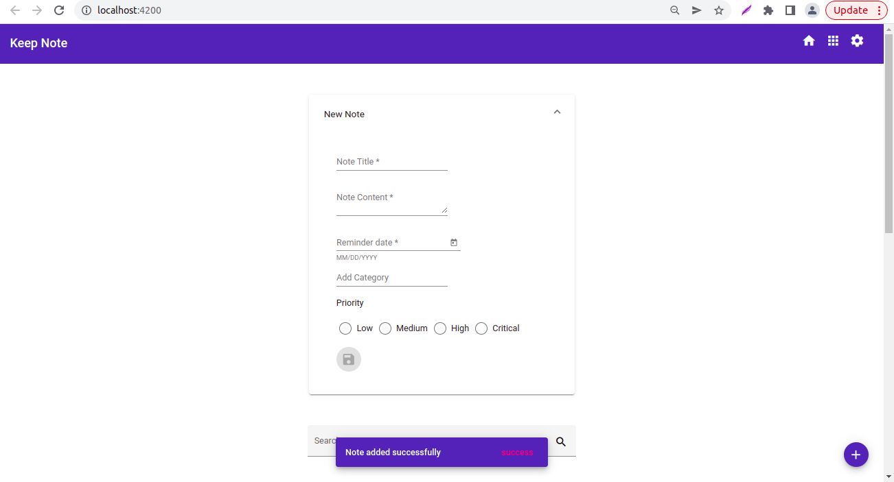
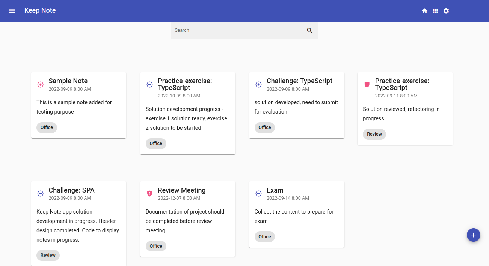

## Challenge - Develop a template driven form to add a note in Keep Note application

### Context

As you are aware, Keep-Note is a web application that allows users to maintain notes. It is developed as a single-page application using multiple components. ​

Note: The stages through which the development process will be carried out are shown below:​

- Stage 1: Create basic Keep-Note application to add and view notes.​
- Stage 2: Implement unit testing for the Keep-Note application.​
- Stage 3: Create Keep-Note application with multiple interacting components to add, view and search notes.​
- Stage 4: Implement persistence in the Keep-Note application.​
- Stage 5: Style the Keep-Note application using Material design.​
- **Stage 6: Create a simple form with validation in the Keep-Note application.​**
- Stage 7: Create complex form with validation in the Keep-Note application.​
- Stage 8: Enable navigation in the Keep-Note application.​
- Stage 9: Secure routes in the Keep-Note application.

In this sprint, we are at Stage 6.​

In the perevious stage, for pleasing aesthetics and a rich user experience, the looks of the Keep-Note application has been enhanced by using the Angular Material library.​

In this stage, a template-driven form should be created to add a new note with additional form fields in the Keep-Note application. The form controls should be validated according to the requirements specified

## Problem Statement

Develop a template-driven form to add a new note. The data model for notes should include properties: title, content, reminder date, category, and priority level. Priority levels should be low, medium, high or critical.​

Following tasks need to be completed to develop the solution for the Keep-Note application:

- Task 1: Modify the data model​
- Task 2: Include the required modules ​
- Task 3: Modify the NoteAddComponent​
- Task 4: Define the form layout inside template​
- Task 5: Handle form validation
- Task 6: Display notification message on successful form submission​
- Task 7: View the newly added note

Instructions related to a few tasks are given below. ​

#### Task 1: Modify the Data Model
- Modify data model `Note` that reflect the form data model. ​
- Modify type `Note` in the `note.ts file` in the `models` folder, which should have the following type properties: ​
- id (number) ​
- title (string) ​
- content (string) ​
- reminderDate (string) ​
- category (number) ​
- priority (string) 


#### Task 5: Handle Form Validation
- Following are the add note form validation requirements:​

|Form Control|Validation Criteria|Error Messages|
|----|-----|----|
|Note Title|Should not be blank| "Note title is required"|
|Note Content|Should not be blank and have minimum length of 5 characters​|"Note content is required", "Note content should have minimim 5 characters"|
|Reminde Date|Should not be blank and date value should be greater than or equal to today's date​| "Reminder date is required"|
|Category|No Validation|Nil|
|Proprity Level|Value should be one among the 4 values - Low, Medium, High or Critical|Nil|

Add name attribute with values matching the model properties to each form control, which Angular uses to register the element with the parent `<form>`.​
Notes: ​
1. The component name (NoteAddComponent), and the form controls with name properties are used in testing and hence must use the same name while coding.​
2. Error messages text should be used as mentioned above as these texts are used in testing.​

#### Task 7: View the Newly Added Note

Following mat-icons should be used for displaying the priority levels while adding the note in a card.

|Priority-level|mat-icon|
|-------------|---------|
|Critical|gpp_maybe|
|High|arrow_circle_up|
|Medium|remove_circle_outline|
|Low|arrow_circle_down|

In the `note.component.html`, priority levels should be displayed next to note title using these mat-icons and `*ngIf` directive.​
```html
    <button *ngIf="note?.priority==='Critical'" color="accent" mat-icon-button>
    <mat-icon>gpp_maybe</mat-icon>
    </button>
```

#### Points to Remember
- In this phase, the solution created for the Keep Note application in the previous sprint `Style a Single-Page Application Using Angular Material` must be used to enhance the add note form.​
- Template-driven form should be created to add a new note. The form input elements must be created using Angular material components​.
- All the required modules to work with Angular forms and material components should be imported in the application root module.​
- Custom styles should be added while designing the form and displaying the note as card.​
- Use HTML5 validation attributes to validate form input values. ​​
- The form should be reset once the new note is added successfully.
- Run the `json-server` to add a note data to the `notes.json` file in the `keep-note-data` folder. ​​


**The template-driven form created should resemble the following images.**

**Add Note Form**



**Add Note Form With Validation Errors**



**Add Note Form With More Validation Errors**



**Add Note Form With Valid Values**



**Successful Form Submission**



**Newly Added note in card**




### Submission Instructions

#### Test the solution locally
- Test the solution first locally and then on `CodeReview` platform. Steps to test the code locally are:​
    - From the command line terminal, set the path to the folder containing cloned boilerplate code.​
    - un the command ng test or npm run test to test the solution locally and ensure all the test cases pass.​
    - Refactor the solution code if the test cases are failing and do a re-run.​​
    - Finally, push the solution to git for automated testing on `CodeReview` platform.​

#### Test the Solution on `CodeReview` platform
Steps to test the code on hobbes are:​
- Open the submission page at `https://codereview.stackroute.niit.com/#/submission`.​
- Submit the solution.​
- For the failed test cases, refactor the code locally and submit it for re-evaluation.​